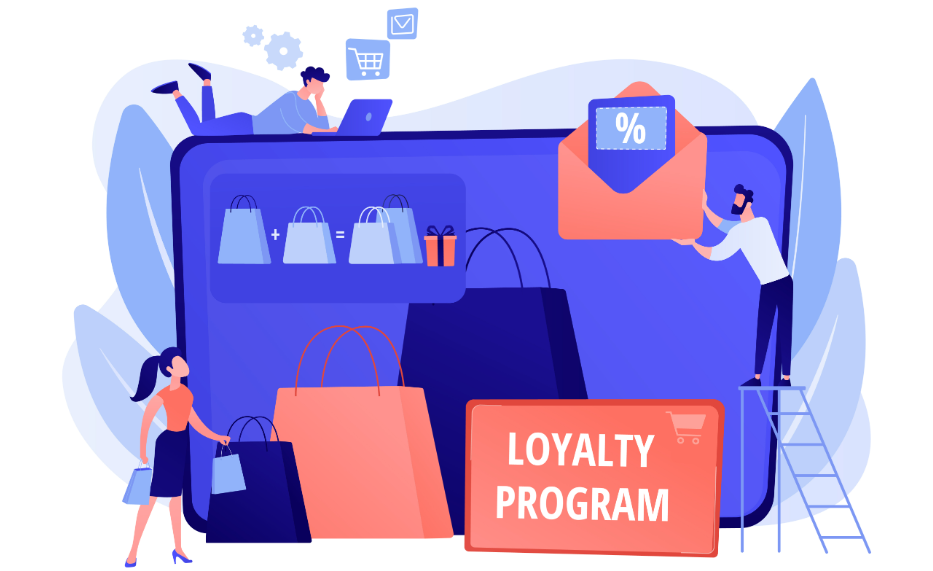
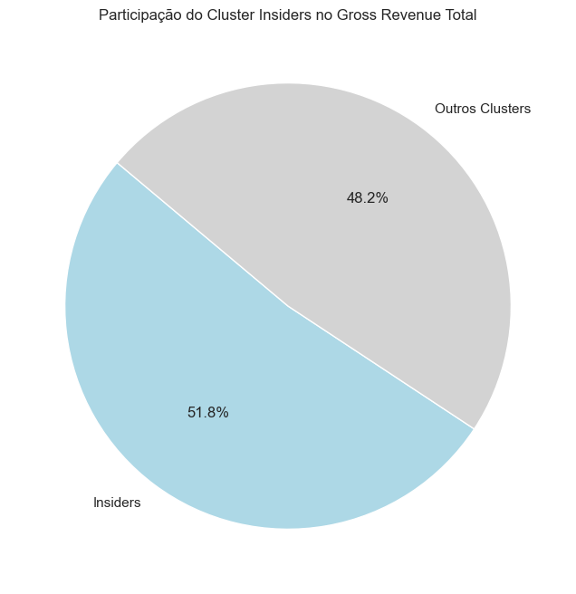
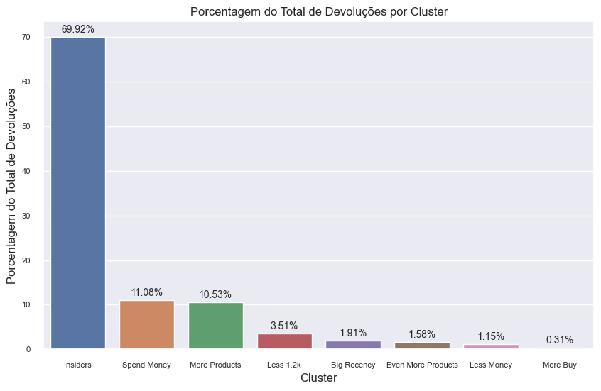
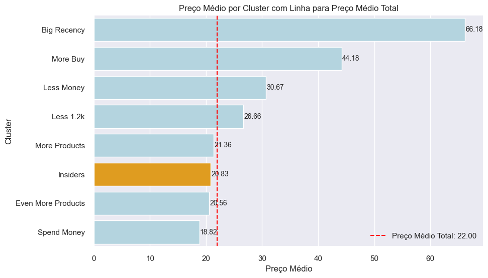
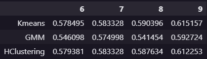
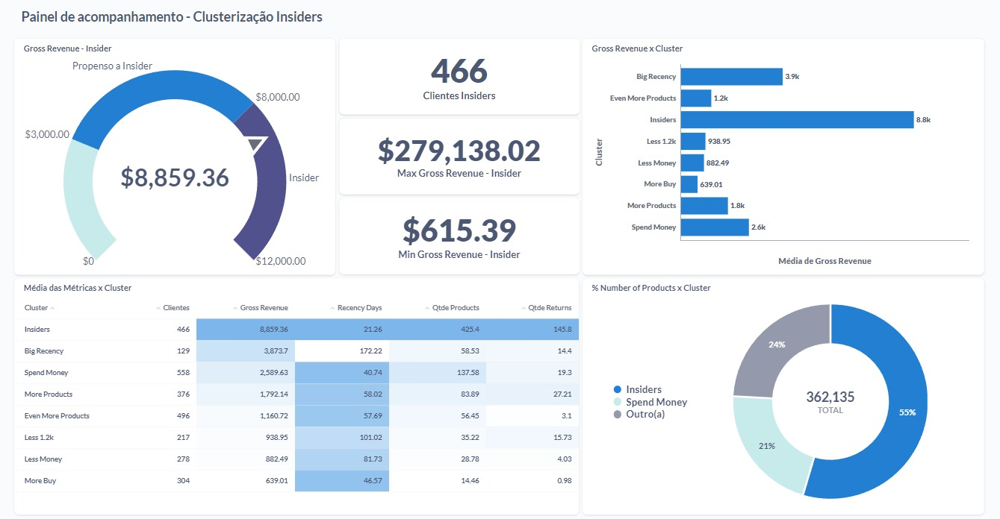
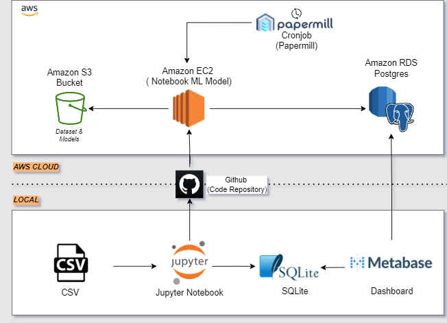

# Customer Loyalty Program for an E-Commerce

# Introdução

Este é um projeto end-to-end de Data Science de um modelo de clusterização. No qual criamos um script focado em encontrar os melhores clientes que irão participar do grupo Insiders. A clusterização foi colocado em produção na AWS.

Este repositório contém a solução para a resolução de um problema do Kaggle, contudo, o mesmo não está mais disponível para resolução, e portanto, sua página foi desativada.

Esse projeto faz parte da "Comunidade DS", que é um ambiente de estudo que promove o aprendizado, execução, e discussão de projetos de Data Science.

### Plano de Desenvolvimento do Projeto de Data Science

Esse projeto foi desenvolvido seguindo o método CRISP-DS(Cross-Industry Standard Process - Data Science). Essa é uma metodologia capaz de transformar os dados da empresa em conhecimento e informações que auxiliam na tomada de decisão. A metodologia CRISP-DM define o ciclo de vida do projeto, dividindo-as nas seguintes etapas:

- Entendimento do Problema de Negócio
- Coleção dos Dados
- Limpeza de Dados
- Análise Exploratória dos Dados
- Preparação dos Dados
- Modelos de Machine Learning, Cross-Validation e Fine-Tuning.
- Avaliação dos Resultados do Modelo e Tradução para Negócio.
- Modelo em Produção

### Planejamento

- [1. Descrição e Problema de Negócio](#1-descrição-e-problema-de-negócio)
- [2. Base de Dados e Premissas de Negócio](#2-base-de-dados-e-premissas-de-negócio)
- [3. Estratégia de Solução](#3-estratégia-de-solução)
- [4. Top Insights](#4-top-insights)
- [5. Seleção do Modelo de Machine Learning](#5-seleção-do-modelo-de-machine-learning)
- [6. Resultados de Negócio](#6-resultados-de-negócio)
- [7. Modelo em Produção](#7-modelo-em-produção)
- [8. Conclusão](#8-conclusão)
- [9. Aprendizados](#9-aprendizados)
- [10. Trabalhos Futuros](#10-trabalhos-futuros)

# 1. Descrição e Problema de Negócio

### 1.1 Descrição

A empresa All in One Place é uma empresa Outlet Multimarcas, comercializa produtos de segunda linha de várias marcas a um preço menor, através de um e-commerce.

### 1.2 Problema de Negócio

A empresa All in One Place é uma empresa Outlet Multimarcas, comercializa produtos de segunda linha de várias marcas a um preço menor, através de um e-commerce.

Em um pouco mais de 1 ano de operação, o time de marketing percebeu que alguns clientes da sua base compram produtos mais caros, com alta frequência e acabam contribuindo com uma parcela significativa do faturamento da empresa.

Baseado nessa percepção o time de marketing vai lançar um programa de fidelidade para os melhores clientes da base, chamado **Insiders**, mas o time não tem um conhecimento avançado em análise de dados para eleger os participantes do programa.

**Para tal desenvolverei um produto de dados que determine os clientes elegíveis permitindo ao time de Marketing tomar ações personalizadas e exclusivas ao grupo, de modo a aumentar o faturamento e frequência de compra.**

### 1.3 Expectativas

Os gestores da All in One Place esperam poder:

- Saber quem são os clientes Insiders;
- Saber aqal o comportamento de compra do cliente Insider;
- Monitorar a mudança dos clusters;
- Visualizar os valores dos cluters e suas mudanças em tempo real;
- Decidir quais serão as estratégias usadas no programa de fidelidade.

# 2. Base de Dados e Premissas de Negócio

## 2.1 Base de Dados

O conjunto de dados total possui as seguintes informações:
Onde cada linha é referente a uma transação (produto comprado).

| **Feature**            | **Description**                                                                   |
| ---------------------- | --------------------------------------------------------------------------------- |
| invoice_no             | id da compra                                                                      |
| stock_code             | id do produto                                                                     |
| description            | descrição do produto                                                              |
| quantity               | quantidade comprada do produto                                                    |
| invoice_date           | data da compra                                                                    |
| unit_price             | preço unitário do produto                                                         |
| customer_id            | id do cliente                                                                     |
| country                | país de entrega                                                                   |

## 2.2 Premissas de Negócio

Com base em pesquisa de mercado foram tomadas as seguintes suposições de negócio:

- Remoção de itens com preço inferior a 0.04.
- Tirar da base os cliente não identificados e aqueles que tem apenas uma compra no período específicado.
- Itens com quantidade negativa ou com o número do pedido destacando a letra 'C' serão considerados estornos.
- Códigos de estoque como 'POST', 'D', 'DOT', 'M', 'S', 'AMAZONFEE', 'm', 'DCGSSBOY','DCGSSGIRL', 'PADS', 'B', 'CRUK' serão removidos por não haver clareza quanto a sua finalidade.
- Removidas compras de clientes para regiões não especificadas ou inconclusivas.

# 3. Estratégia de Solução

A estratégia de solução foi a seguinte:

### Passo 01. Descrição dos Dados

Coleto os dados e realizo uma breve análise e suas estatísticas, também limpo alguns dados com potenciais comprometedoras, o meu objetivo se concentra está em ganhar conhecimento inicial do problema em que estou lidando e começar a planejar quais ferramentas devo utilizar na manipulação para os algoritmos.

### Passo 02. Filtragem de Variáveis

Nesta etapa busco remover algumas variáveis criadas para auxiliar o processo de Feature Engineering, também removo a coluna 'description' por não conter informação relevante.

### Passo 03. Featuring Engineering

Desenvolvo hipóteses iniciais sobre o negócio para poder derivar novos atributos com base nas variáveis originais para descrever melhor o fenômeno a ser compreendido, estes atributos podem me auxiliar na validação de hipóteses e no treinamento do modelo de Machine Learning.

### Passo 04. Análise Exploratória dos Dados (EDA)

Realizo estudos das variáveis univariadas e como os dados se comportam bivariados, também busco compreender o comportamento de cada variável e suas correlações com as demais.

### Passo 05. Preparação dos Dados

Sessão que trata da preparação dos dados para que os algoritmos de Machine Learning possam ser aplicados. Foram realizados alguns tipos de escala e encoding para que as variáveis categóricas se tornassem numéricas.

### Passo 06. Estudo do Espaço

Realizo transformações do espaço de dados com o objetivo de gerar uma melhor segmentação dos clientes afim de encontrar os melhores perfis.

### Passo 06. Seleção de Variáveis do Algoritmo

Na seleção dos atributos foi realizado um estudo de importância das colunas, no qual os atributos mais significativos foram selecionados para um estudo mais aprofundado com intuito de gerar melhor entendimento e criar features que separam melhor os dados.

### Passo 07. Modelo de Machine Learning

Realização do treinamento dos modelos de Machine Learning. O modelo que apresentou melhor Silhouette Score com um número de cluster igual a 8 foi escolhido.

### Passo 08. Hyper Parameter Fine Tuning

Foi encontrado os melhores parâmetros que faziam a clusterização convergir para o mesmo valor sempre.

### Passo 09. Cluster Analysis

Através dos clusters gerados pelo modelo, uma análise foi feita com o intuito de entender melhor as características de cada cluster, identificar o cluster Insiders e responder as perguntas de negócio.

### Passo 10. Deploy do Modelo em Produção

Nesta etapa o projeto é disponibilizado via Dashboard no Metabase com as informações de cada grupo para o programa de fidelidade. Com isso, é desenvolvido uma arquitetura na AWS para colocar esse projeto em produção, com o banco, dataset, encoders, modelos e máquina virtual direto na cloud.

# 4. Top Insights

### H1 - Os clientes do cluster insiders possuem um volume (faturamento) de compras acima de 10% do total de compras.

**VERDADEIRO** O faturamento do cluster insiders é mais da metade do total de faturamento

- No primeiro gráfico podemos ver a proporção que representa o Gross Revenue dos Insiders.
- Esse comportamento é comum no varejo, onde poucos clientes são responsáveis por uma grande porção da receita.

### H2 - Os clientes Insiders retornaram menos de 20% do total de produtos retornados na base.

**FALSO** - O cluster Insiders retornou quase 70% do total

- No gráfico podemos observar que os clientes Insiders são os que mais retornam.
- Pode ser um comportamento característico desse Ecommerce, onde um grande gasto está atrelado a um alto número de devoluções

### H3 - O Preço Médio dos produtos comprados pelo cluster Insiders é maior que o preço médio total e de todos os clusters.

**Falso** - O Preço Médio dos produtos comprados pelo cluster Insiders é menor que o total e que outros 5 clusters.

- No gráfico observamos o Preço Médio do cluster Insiders é de $20.83, isso significa que em média cada produto comprado pelo cliente Insider custa esse preço.
- Contudo, ele não é dos maiores, isso indica que para se tornar Insider o cliente não precisa comprar produtos caros, mas isso comprar muitos produtos.

# 5. Seleção do Modelo de Machine Learning

Os seguintes algoritmos de Machine Learning foram aplicados:

- K-Means;
- GMM;
- Hierarquical Clustering;

Esses modelos foram aplicados com um número de grupos (k) de 2 a 24 e o melhor algoritmo de agrupamento foi o GMM. Porém, escolhemos k como 8 porque com esse número de grupos é possível ter um bom desempenho do modelo (pontuação de silhueta) e fica mais fácil para a equipe de marketing criar ações direcionadas para cada grupo com um número não tão grande de grupos.

Os algoritmos utilizados para criar os espaços de incorporação foram: PCA, UMAP, t-SNE e uma incorporação baseada em árvores com Random Forest (espaço final).

# 6. Resultados de Negócio

## 6.1. Resultados do Modelo

Para medir o desempenho dos modelos, usamos a métrica Silhouette Score, e para cara modelo encontramos os seguintes valoes: (de 6 a 9 clusters)

  

Através dessa tabela, podemos ver que o GMM apresentou os menores valores, contudo, ele foi escolhido como modelo final, devido a análise da silhueta gerada e a análise mais coerente gerada na divisão dos pontos.

## 6.2 Definições do Cluster

A entrega desse projeto visa destacar o perfil do cluster Insiders para que a equipe de Marketing possa tomar decisões, portanto será listada algumas características do grupo.

Principais características:
| Cluster Name | Nº Customers | Customers (%) | Gross Revenue | Recency Days | Qty Products |	Qty Returns |
|--------------|-------------|---------------|---------------|--------------|--------------|-------------------|
| Insiders     |	466      |	  16.50      |	$8859.36    |	21.26    |   425.40    |   145.79       |

## 6.3 Dashboard no Metabase

A partir da clusterização um Dashboard foi criado no Metabase, o intuito dele é mostrar as características dos Insiders e como ele se diferencia dos demais clusters.

  

# 7. Modelo em Produção

## 7.1. Diagrama do Modelo em Produção

O modelo de Machine Learning foi implementado e colocado em produção por meio da AWS, que tem como objetivo possibilitar a criação, execução e operação localizados em nuvem.

  

## 7.2. AWS

Esse projeto foi realizado utilizando o Free Tier da AWS, dessa forma, todas as instâncias foram encerradas. Quando estavam abertas, eram as seguintes:

### 7.2.1 S3

  

### 7.2.2 RDS

  

### 7.2.3 EC2

  

# 8. Conclusão

A partir dos resultados do negócio, pode-se concluir que o objetivo do projeto foi alcançado. Os problemas de agrupamento são geralmente mais complexos de resolver, é claro, porque não há variável de resposta. Portanto, é importante ter uma estratégia definida para a abordagem da solução, muitas vezes baseada no conhecimento do negócio.

O programa de fidelidade é importante para o negócio porque os Insiders representam grande parte da receita da empresa e segmentar seus clientes ajuda a equipe de marketing a segmentar seus clientes a priorizar e agir com base em seu consumo para aumentar a frequência de vendas e a receita.

# 9. Aprendizados

- **Clustering**: Problemas de clusterização envolvem novas abordagens e não são acompanhados de uma resposta, para tal o resultado deve ser constantemente mensurado.
- **Embedding**: Embedding constitui em transformações dos dados para um novo espaço teoricamente mais organizado, é possível utilizar em todos os problemas de Ciência de Dados para melhorar a performance ou estudar como é feito a organização, mas é importante notar a perca de explicabilidade do processo.
- **Pipeline**: Nesse projetofoi desenvolvido uma arquitetura em cloud desenvolvendo toda a arquitetura do seu funcionamento e como se correlaciona, o planejamento ajuda imensamente o sucesso do Deploy.
- **Clouds**: Foi desenvolvido o deploy na AWS onde houve o aprendizado sobre alguns dos serviços prestados e como implementá-los.
- **Dashboard**: Utilizou-se da ferramenta Metabase para construir gráficos/tabelas que buscam entregar o resultado esperado.

# 10. Trabalhos Futuros

- **Feature Engineering**: Criação de novas features.
- **Embedding**: Desenvolver um melhor estudo sobre os embeddings para o espaço de dados, novas técnicas, novos testes de diferentes perspectivas, mais colunas de embedding.
- **Test A/B**: Realizar teste A/B para comprovar a eficiência do projeto.
- **Faturamento**: Desenvolver previsão de faturamento do novo grupo de Insiders.
- **Hipóteses**: Desenvolver novas hipóteses de negócio para analisar o comportamento dos Clusters.
- **Dashboard**: Acompanhar o uso do dashboard e otimizar as informações prestadas, também disponibilizar em Cloud.
